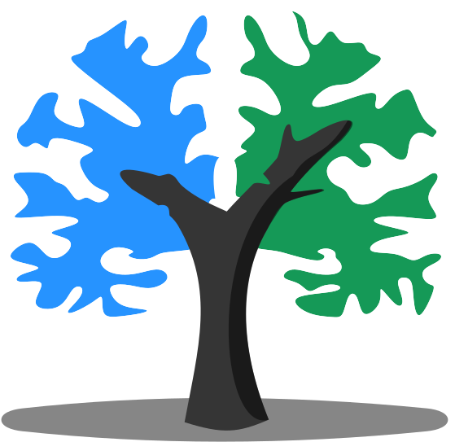

# Can we identify gender using fMRI?

Team contributors: Tajwar Sultana

## Summary 

This project will try to identify gender using fMRI data by applying Machine Learning models.  It would be interesting to see whether functional connectivity differs between male and female. Somewhat similar study performed [here](https://journals.lww.com/neuroreport/Abstract/2005/02280/Gender_differences_in_the_processing_of_disgust_.15.aspx).

## Project definition 

### Background

I am a Computer Engineering PhD student and my topic of research is Effective Brain Connectivity using fMRI. Being Computer Engineer, I already had the exposure of python and machine learning and very little github. Now it would be great to exercise the machine learning principles on neuroimaging data. 

### Tools 

 - Python visualization and machine learning packages (nilearn, scikit-learn, matlplotlib...)
 - Github for version control 
 - NO virtualization (I so wanted to explore virtualization but docker is not compatible with my WSL)

### Data 

I will be using Nilearn development_fmri dataset. I explored many other open data sources but those required preprocessing. In order to save time and complete this project during 3-week period, I chose Nilearn preprocessed dataset. The data was collected during a [study](https://nature.com/articles/s41467-018-03399-2) in which a short film was watched by 33 adults and 122 children (age 3-12) while undergoing fMRI. The study was meant to characterize the development of functionally specialized social brain regions. For my project, the target variable would be gender and features would be the functional connectivity matrix.

### Deliverables

 - Jupyter notebook with predictive model 
 - Presentation slides
 - This document/report that you are reading marked as "Completed"  

## Results 

### Progress overview

Started on 19th May 2020 as a project for Brainhack School. Progress is made only in the area of data selection and report yet. 

### Tools I learned during this project

 * I think I would be able to used github efficiently at the end of this project
 * Machine learning packages for neuroimaging 
 
### Results 

#### Deliverable 1: report template

#### Deliverable 2: project gallery

#### Deliverable 3: Instructions 
 
 
 
 
## Conclusion and acknowledgement

