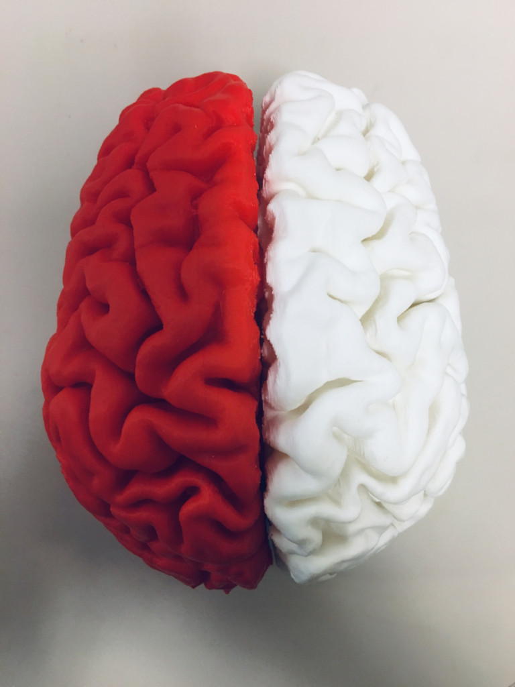

# Can we identify gender using fMRI?

Team contributors: Tajwar Sultana and Brainhack School

## Summary 

I am a Computer Engineering PhD student and my topic of research is Effective Brain Connectivity Analysis using fMRI. Being Computer Engineer, I already had the exposure of python and machine learning and very little github. The main focus of this project was to learn data visualization and machine learning on neuroimaging data. This project made an attempt to identify gender using fMRI data by applying Machine Learning models.  

## Project definition 

### Background

This project is based on the hypothesis that there is a difference in the functional connectivity between male and female. There has been quite a lot of research on the gender differences. Somewhat similar study performed [here](https://journals.lww.com/neuroreport/Abstract/2005/02280/Gender_differences_in_the_processing_of_disgust_.15.aspx). If this hypothesis holds true then gender _can_ be identified using functional connectivity.

### Tools 

 - Data Visualization (matplotlib, seaborn, plotly, pywidgets)
 - Machine learning packages (nilearn, scikit-learn)
 - Github for version control 
 - VS Code
 - Bash Terminal

### Data 

I used Nilearn development_fmri dataset. I explored many other open data sources but those required preprocessing. In order to save time and complete this project during 3-week period, I chose Nilearn preprocessed dataset. The data was collected during a [study](https://nature.com/articles/s41467-018-03399-2) in which a short film was watched by 33 adults and 122 children (age 3-12) while undergoing fMRI. The study was meant to characterize the development of functionally specialized social brain regions. The target variable for my project was gender and features were obtained by finding correlation between different regions of interest.

### Deliverables

 - Data Visualization 
 - Predictive models with evaluation metrics 
 - Presentation slides
 - Project Report  

## Results 

The evaluation metrics of different machine learning models applied on the dataset are as follows:

Following plot shows the distribution of data with respect to the Principal Components.

This is an interactive plot with sliders to choose the Principal Components to view. The interactive version can be found in the notebook [here](https://github.com/brainhack-school2020/tjays7_fmri/blob/master/Code/Models-Metrics.ipynb)

### Progress overview

This project was started by Tajwar Sultana on 19th May 2020 as part of the Brainhack School and the final presentation was delivered on 5th June 2020. The deliverables including code, interactive plot, report and presentation are completed.

### Tools I learned during this project

 * Github
 * Nilearn (Machine learning package for neuroimaging)
 * Interactive plotting
 
 ## Conclusion and acknowledgement

This project was basically adopted to learn data visualization and machine learning on neuroimaging data. The results of machine learning models shows that there is a lot of improvement required in classification of gender using functional connectivity. 

Gratitude to all the organizers, instructors, TAs and fellow participants who helped us learn cool open neuroscience tools. Special thanks to my instructors Desiree, Greg, Benjamin and a token of appreciation to Elizebath and Jakob for their inspiring work and help in this project. 

## References:

Susanne Weis, Kaustubh R Patil, Felix Hoffstaedter, Alessandra Nostro, B T Thomas Yeo, Simon B Eickhoff, Sex Classification by Resting State Brain Connectivity, Cerebral Cortex, Volume 30, Issue 2, February 2020, Pages 824–835, https://doi.org/10.1093/cercor/bhz129

Chao Zhang  Chase C. Dougherty  Stefi A. Baum  Tonya White  Andrew M. Michael, Functional connectivity predicts gender: Evidence for gender differences in resting brain connectivity, Volume 39, Issue 4, April 2018, Pages 1765-1776,  https://doi.org/10.1002/hbm.23950
