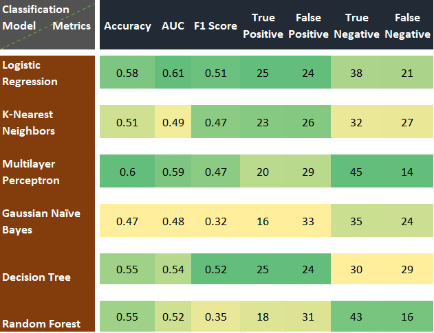

# Can we identify Sex using fMRI?

Team contributors: Tajwar Sultana

## Summary 

Does functional connectivity between brain regions differ in male and female? If yes then fMRI data can be used to distinguish sex on the basis of the difference in functional connectivity. I applied supervised Machine Learning algorithms on the fMRI data to classify sex.

## Project definition 

### Background

This project is based on the hypothesis that there is a difference in the functional connectivity between male and female. There has been quite a lot of research on the sex differences. Somewhat similar study performed [here](https://journals.lww.com/neuroreport/Abstract/2005/02280/Gender_differences_in_the_processing_of_disgust_.15.aspx). If this hypothesis holds true then sex _can_ be identified using functional connectivity.This project is based on the hypothesis that there is a difference in the functional connectivity between male and female. There has been quite a lot of research on the brain connectivity differences based on gender. A [review](https://www.ncbi.nlm.nih.gov/pmc/articles/PMC3250567/)  paper suggests that anatomical and functional connectivity between brain regions is effected by gender. If this hypothesis holds true then sex _can_ be identified using functional connectivity.

### Tools 

 - Data Visualization (matplotlib, seaborn, plotly, pywidgets)
 - Machine learning packages (nilearn, scikit-learn)
 - Github for version control 
 - VS Code
 - Bash Terminal

### Data 

Many open data sources were explored but those required preprocessing. In order to save time and complete this project during 3-week period, I selected Nilearn preprocessed dataset. The Nilearn's Development fmri data was collected during a [study](https://nature.com/articles/s41467-018-03399-2) in which a short film was watched by 33 adults and 122 children (age 3-12) while undergoing fMRI. The study was meant to characterize the development of functionally specialized social brain regions. The target variable for my project was gender and features were obtained by finding correlation between different regions of interest.

### Deliverables

 - Interactive Plots 
 - Predictive models with evaluation metrics 
 - Presentation slides
 - Project Report  

## Results 

#### _Functional Connectome_  

#### _Interactive Scatter Plot of Principal Components_

#### _Evaluation Metrics_

### Progress overview

This project was initiated by Tajwar Sultana on 19th May 2020 as part of the Brainhack School and the final presentation was delivered on 5th June 2020. The deliverables including code, interactive plot, report and presentation are completed.

### Tools I learned during this project

 * Github
 * Nilearn (Machine learning package for neuroimaging)
 * Plotly, ipywidgets (Python packages for Interactive plotting)
 
 ## Conclusion 

This project was basically adopted to learn data visualization and machine learning on neuroimaging data. The results of machine learning models show that there is a lot of improvement required in sex classification using functional connectivity. 

The scatter plot of Principal Components illustrates that sex does not explain the variance in the given data. Hence,it can be concluded that the features extracted from the dataset in the form of connectivity matrices were not appropriate for this problem. There could be two reasons for this: 
*  The dataset consists of subjects of multiple ages including children and adults and age could be a factor effecting functional connectivity changes
*  In this study, parcellation scheme was used with 64 brain regions. It might not be necessary that all those regions reflect functional connectivity changes between male and female. Hence, care must be taken in selecting regions of interest
 
 This is just a preliminary study which could lead to the development of more robust machine learning models for the sex classification with functional connectivity features. 

## Acknowledgement

Gratitude to all the organizers, instructors, TAs and fellow participants who helped me learn cool open neuroscience tools. Special thanks to my instructors Desiree, Greg, Benjamin and a token of appreciation to Elizebath and Jakob for their inspiring work. 

## References:

Susanne Weis, Kaustubh R Patil, Felix Hoffstaedter, Alessandra Nostro, B T Thomas Yeo, Simon B Eickhoff, Sex Classification by Resting State Brain Connectivity, Cerebral Cortex, Volume 30, Issue 2, February 2020, Pages 824–835, https://doi.org/10.1093/cercor/bhz129

Chao Zhang  Chase C. Dougherty  Stefi A. Baum  Tonya White  Andrew M. Michael, Functional connectivity predicts gender: Evidence for gender differences in resting brain connectivity, Volume 39, Issue 4, April 2018, Pages 1765-1776,  https://doi.org/10.1002/hbm.23950
